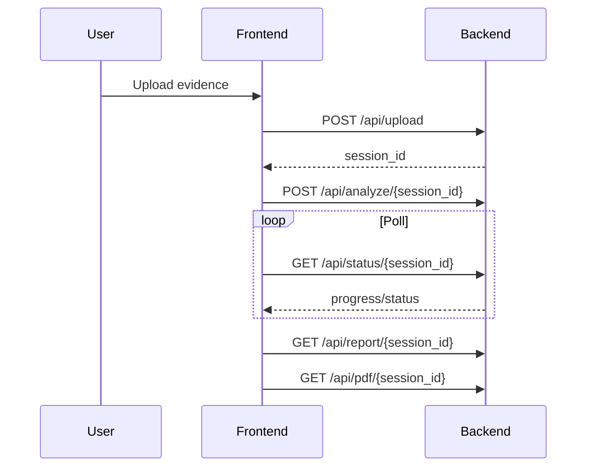

# API Reference

## Overview

The Alfa Hawk backend exposes a small HTTP API for evidence upload, asynchronous analysis, report retrieval, PDF export, and frame access.

Base behavior:

- frontend assets are served by Flask
- API responses are JSON except for PDF and frame binary responses
- most platform operations expect an `X-Client-ID` header
- current production pipeline accepts image and video evidence

## Endpoints

### `POST /api/upload`

Upload an evidence file and create a temporary in-memory session.

Headers:

- `X-Client-ID: <client-id>`

Form fields:

- `file`: image or video file
- `case_number`: optional
- `officer_id`: optional
- `case_description`: optional
- `ai_api_key`: optional BYO Gemini key

Response:

```json
{
  "session_id": "uuid",
  "metadata": {},
  "mode": "Platform AI",
  "message": "Evidence validated and staged in memory."
}
```

### `POST /api/analyze/<session_id>`

Start the background analysis pipeline for an uploaded session.

Headers:

- `X-Client-ID: <client-id>`

Response:

```json
{
  "session_id": "uuid",
  "status": "analyzing",
  "message": "Analysis started."
}
```

### `GET /api/status/<session_id>`

Retrieve current progress and final report availability.

Response fields may include:

- `status`
- `progress`
- `progress_message`
- `metadata`
- `error`
- `has_report`
- `has_pdf`
- `report`

### `GET /api/report/<session_id>`

Return the structured report JSON once analysis is complete.

Response:

```json
{
  "session_id": "uuid",
  "report": {}
}
```

### `GET /api/pdf/<session_id>`

Download the generated PDF report for a completed session.

Output:

- `application/pdf`

### `GET /api/frames/<session_id>`

List all extracted frames for a session.

Response:

```json
{
  "session_id": "uuid",
  "frames": [
    {
      "frame_id": "F1",
      "timestamp": 1.0,
      "timestamp_formatted": "00:00:01",
      "description": "Observation",
      "url": "/api/frames/<session_id>/F1"
    }
  ]
}
```

### `GET /api/frames/<session_id>/<frame_id>`

Retrieve a single extracted frame as an image binary response.

Output:

- `image/jpeg`

### `DELETE /api/cleanup/<session_id>`

Delete a session and release associated in-memory data.

### `GET /api/usage`

Return client and platform usage statistics.

Headers:

- `X-Client-ID: <client-id>`

### `GET /health`

Basic health endpoint with status, timestamp, active session count, and storage model summary.

### `GET /api/debug/sessions`

Debug endpoint that exposes internal session state summaries. It is disabled by default and should only be enabled intentionally in development.

## Typical Workflow



## Error Handling

Common error conditions:

- missing `X-Client-ID`
- unsupported file types
- oversized media
- invalid BYO API key
- expired or missing session IDs
- report or PDF requested before completion
