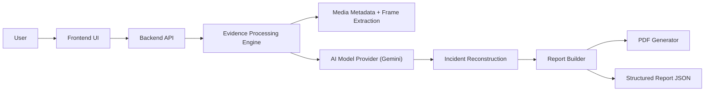

# Alfa Hawk Architecture

## System Components

Alfa Hawk is organized into a browser-facing frontend, a Flask backend, an evidence-processing engine, an AI provider abstraction layer, and a report-generation pipeline.

Primary components:

- Frontend UI in `frontend/`
- Backend API in `backend/app.py`
- Evidence engine in `backend/engine/evidence_engine.py`
- AI provider interfaces in `backend/ai_providers/`
- Media and frame utilities in `backend/engine/` and `backend/utils/validation.py`
- Report builder and PDF generator in `backend/reporting/report_builder.py` and `backend/reporting/pdf_generator.py`

## High-Level Architecture Diagram

## Frontend Architecture

The frontend is a single-page workstation-style interface built with:

- HTML
- CSS
- vanilla JavaScript

Key responsibilities:

- evidence upload interaction
- session-driven polling of analysis status
- rendering Overview, Timeline, Persons, Objects, Frames, and Export tabs
- opening evidence frame viewers and frame-linked timeline interactions
- downloading JSON and PDF outputs

The frontend is served directly by the Flask backend as static assets by default, but it can also point to a separate API origin through the configurable frontend API base setting.

## Backend Architecture

The backend exposes a lightweight API and in-memory session store.

Core responsibilities:

- receive and validate uploaded evidence
- create short-lived in-memory processing sessions
- enforce platform limits and abuse protections
- run the evidence analysis pipeline in a background thread
- expose status, reports, PDF output, and frame retrieval endpoints

The session model stores:

- uploaded evidence bytes
- metadata
- extracted frames
- AI analysis output
- generated report
- generated PDF bytes

## Evidence Processing Engine

The `EvidenceEngine` acts as the open-source core orchestrator.

Key duties:

- pre-check evidence sanity
- compute integrity hashes
- extract metadata
- extract frames from video or normalize images into frame entries
- call the configured AI provider
- validate returned schema
- build the structured forensic report

This layer is intentionally decoupled from server concerns so the core can be separated from hosted platform logic over time.

## AI Integration Layer

The `AIProvider` base class defines a standard output schema for AI-assisted evidence analysis.

Current implementation:

- `GeminiProvider` in `backend/ai_providers/gemini.py`

The provider is responsible for:

- secure API key usage
- temporary upload of media to the AI provider when required
- structured JSON generation
- cleanup of provider-side uploaded artifacts after analysis

## Report Generation Pipeline

The report pipeline converts AI output plus extracted evidence into structured deliverables.

Stages:

1. AI output normalization
2. incident phase building
3. timeline and evidence-frame linking
4. person and object registry generation
5. risk and confidence summarization
6. JSON report assembly
7. PDF rendering with watermarking and attribution

## Architectural Notes

- Storage model: in-memory session store by default
- Concurrency model: background thread per active analysis request
- Hosted safeguards: per-client and per-IP quotas, cooldowns, and concurrency limits
- Current code contains some legacy configuration references, but the active provider abstraction is aligned around Gemini-based analysis
