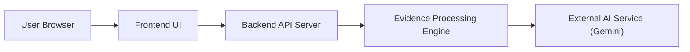

# Deployment Guide

## Deployment Overview

Alfa Hawk can be deployed for local development, internal self-hosting, or hosted platform use. The current implementation ships as a Flask backend serving a static frontend.

High-level runtime pattern:



## Environment Requirements

Recommended baseline:

- Python 3.11+
- pip
- OpenCV-compatible runtime
- FFmpeg available for richer media workflows
- Gunicorn for VPS or container production serving
- network access to the external AI provider when using hosted AI analysis

Operational considerations:

- sufficient RAM for in-memory evidence sessions
- outbound access to Gemini APIs when AI analysis is enabled
- reverse proxy for production deployments

## Local Development Setup

1. Clone the repository.
2. Install backend dependencies.
3. Configure environment variables.
4. Start the Flask backend.
5. Access the web UI through the backend host.

Example:

```bash
git clone https://github.com/Godwin1603/smart-evidence-writer.git
cd smart-evidence-writer
pip install -r backend/requirements.txt
python backend/app.py
```

Production command example:

```bash
gunicorn -w 2 -b 0.0.0.0:${PORT:-5000} backend.app:app
```

## Cloud Deployment

Typical cloud deployment layout:

- reverse proxy or ingress
- application container running Flask backend
- static frontend served by the backend or separate web tier
- outbound access to AI provider APIs

For hosted deployments, consider:

- TLS termination
- request timeouts suitable for video analysis
- horizontal scaling with externalized shared state if moving beyond single-instance memory sessions

## Environment Variables

Known environment variables in the current codebase include:

- `GEMINI_API_KEY`
- `PORT`
- `FLASK_DEBUG`
- `ENABLE_DEBUG_ROUTES`
- `CORS_ALLOWED_ORIGINS`
- `MAX_UPLOAD_SIZE`
- `MAX_VIDEO_DURATION`
- `GLOBAL_DAILY_LIMIT`
- `MONTHLY_LIMIT`
- `REQUEST_COOLDOWN_SECONDS`
- `MAX_CONCURRENCY_PER_CLIENT`
- `MAX_CONCURRENCY_PER_IP`

Practical note:

- the current provider abstraction and primary forensic workflow are Gemini-oriented
- the current deployable pipeline supports image and video evidence
- deeper audio workflows remain roadmap work and should not be advertised as production-ready yet

## Scaling Considerations

The current implementation uses in-memory session storage and in-process tracking maps.

This is suitable for:

- local development
- demos
- controlled single-instance deployments

For production scaling, consider replacing in-memory state with:

- Redis for sessions and quotas
- persistent job queue for long-running analyses
- object storage only if your privacy model explicitly allows it

## Deployment Recommendations

- Keep upload size and duration limits enforced at both proxy and app layers.
- Run the service behind a reverse proxy.
- Restrict debug endpoints in non-development environments.
- Set `CORS_ALLOWED_ORIGINS` explicitly for split frontend/backend deployments.
- If the frontend is hosted separately, set the UI API base through the `alfa-hawk-api-base` meta tag or `window.ALFA_HAWK_API_BASE`.
- Monitor memory pressure due to in-memory media handling.
- Use BYO AI mode for isolated customer-controlled deployments where appropriate.
