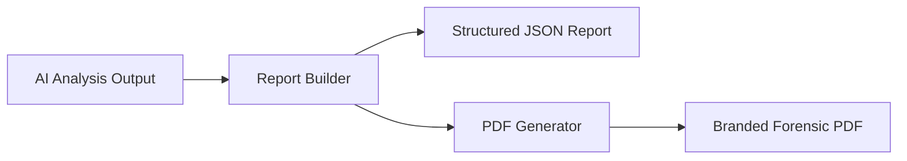

# Report Structure

## Overview

Alfa Hawk generates structured forensic reports in JSON and PDF forms. The report format is designed to preserve technical metadata, evidence linkage, and investigator-friendly scannability.

## Report Sections

### Executive Summary

A concise high-level description of the observed incident, written in investigator-facing language.

### Evidence Integrity

Captures integrity and technical context such as:

- SHA-256 evidence hash
- file size
- media format
- resolution
- frame rate
- duration
- processing timestamp

### Scene Description

Describes the visible environment and available camera context.

### Incident Reconstruction

Breaks the incident into chronological phases supported by evidence references.

### Persons of Interest

Lists identified or tracked individuals with role descriptors, first-seen times, and evidence links.

### Objects Detected

Records relevant objects, weapons, or scene items with timestamps and descriptive context.

### Chronological Timeline

Presents ordered events with timestamps and associated evidence frames.

### Threat Assessment

Summarizes risk or threat indicators generated from visible evidence and AI interpretation.

### Investigative Leads

Provides follow-up suggestions or lead-generation prompts for investigators.

### Evidence Frames Appendix

Includes extracted evidence exhibits and frame-referenced observations to support report traceability.

## Report Lifecycle

## Branding and Attribution

Generated reports include Alfa Hawk attribution and branded watermarking. This preserves provenance and platform identity even when reports are exported.

## Reference Example

Generated reports are included in the repository for user and evaluator reference:

- [AlfaHawk_Forensic_Report_227594d2.pdf](C:\smart-evidence-writer\examples\AlfaHawk_Forensic_Report_227594d2.pdf)
- [Forensic_Report_5af81eae.pdf](C:\smart-evidence-writer\examples\Forensic_Report_5af81eae.pdf)
- [Evidence_Report_ (5).pdf](C:\smart-evidence-writer\examples\Evidence_Report_%20(5).pdf)

## Intended Usage

Reports are intended to support:

- evidence triage
- investigator review
- case documentation
- internal operational reporting

Reports are not a substitute for independent evidentiary verification.
